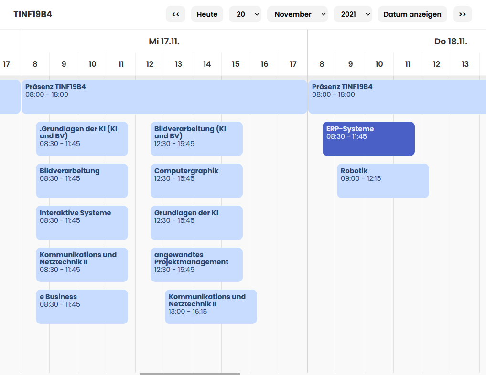

# Rapla++

Rapla aber übersichtlicher



## Installation

3. Unterschiedliche Optionen

### Chrome

1. [chrome://extensions/](chrome://extensions/)
2. Enable **Developer mode**
3. Click **Load unpacked**
4. `chrome` Ordner auswählen

### Tampermonkey

Utilities > File > Import **Browse**

`universal/rapla++_tampermonkey.json` importieren

### Universal

`universal/injected.js` mit einem JS injector Plugin für `https://rapla.dhbw-karlsruhe.de/rapla?page=calendar*`

## Development

```shell
# einmalig
npm install
```

```shell
# einfacher build
npm run build 
```

```shell
# auto rebuild
npm run watch 
```
